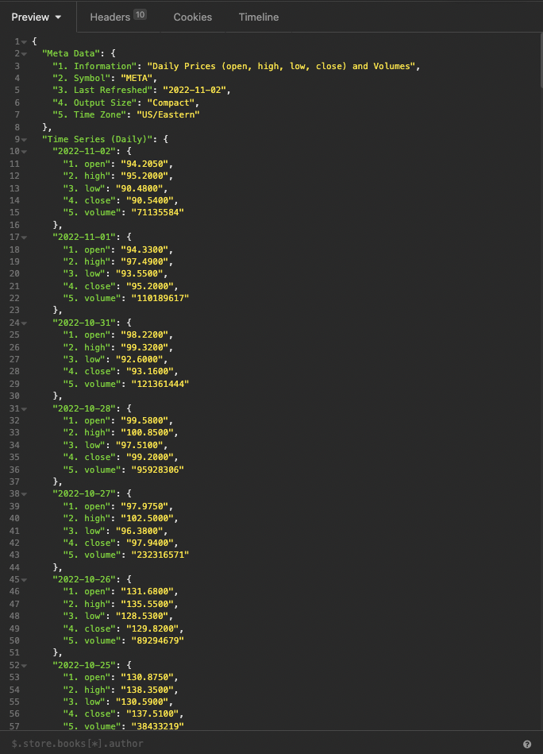

# Wolter-Finance

## General Overview

- Wolter Finacne is going to be a financial app that allows users to keep up to date on finances across the United States.
- To begin and get all my information, I plan on using the Alpha Vantage API which can be accessed from the link below.
- API (https://www.alphavantage.co/documentation/)
- The inspiration for my project comes from Yahoo Finance, and while there are certainly similarities Wolter Finance has it's own twist.
- Users will be greeted on our landing page which will show four tabs each leading to different parts our our website.
- Home tab will take them to current financial news stories. Ranging from crypto, housing market, currency exchange, interest rates etc.
- Company Overview tab will take users to a page of the top 25 companies by market cap in the united states. Here users will be able to click on said company and gather futher information.
- Stocks tab will bring users to a fairly empty screen with a search bar and prompts on the side. Users will be able to type in the search bar a company tiker and gather information on the companies stock.
- The stocks tab will have various options such as intraday, daily, weekly, monthly, and year information about a companies stock.
- Crypto tab will be very similar to the stocks tab. This may become a stretch goal but should operate in very similar ways to the stocks tab.

## Styling

- The styling for Wolter Finance is going to be classy and sleek, there will be a big focus on minimalism.
- A grid system will be used for almost everything, as I believe this is a great way to keep information organized.
- Of course we will need to keep information color coded, so expecting a lot of red for negative percentages and green for positive percentages.
- If possible adding in company logos will be a nice touch
- If possible I would like to add in sliding tickets on the top of the screen that shows their price and pecentage change during the day. These tickers will come from the trending side of the market.

## Logic and Tech

- As mentioned before the brains of the operation will be using the Alpha Vantage API.
- With this API using axios and react is really how we are going to combine all the information recieved and rendered on screen.
- Utilizing componenets to keep our information seperate is also going to be extremley important.
- As of now there will be four seperate components that were listed above in the General Overview section.
- Javascript, and CSS will of course be used as well to add functionality to our app and style it.

## Post MVP

- My biggest ambition for the project is going to see if I can get my data to update live in specific sections. An example of this would have the intraday trading for stocks be updated every one minute using the given info from the API.
- Getting the sliding bar across the title screen would be a great animation to have and show off trending stocks.
- Getting charts to show accurate data in my stocks section.

## Wireframe

- Link to wireframe attached below
  [Link to wireframe](https://wireframe.cc/Iy8dou)

## Trello

- Link to Trello attached below
  [Link to trello](https://trello.com/b/17KqBuWN/project2)

## Working API call

- Picture of API call producing data from Insomnia attached below
  
